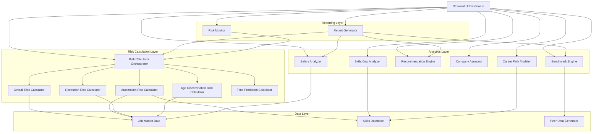

# Design Document: Job Risk Predictor Enhancements

## Overview

This design extends the existing Job Risk Predictor application to provide comprehensive career risk assessment across multiple dimensions. The current system uses a single logistic regression model trained on real job market data to predict unemployment risk. This enhancement adds:

- **Multi-dimensional risk assessment**: Automation, recession vulnerability, and age discrimination risks alongside overall risk
- **Time-based predictions**: Risk forecasts across 6-month, 1-year, 3-year, and 5-year horizons
- **Advanced UI components**: Multi-risk dashboard with gauge charts, risk breakdown visualizations, and trend monitoring
- **Salary and benchmarking**: Location-adjusted salary analysis and peer comparison using synthetic data
- **Actionable intelligence**: ROI-quantified recommendations, skills gap analysis, and career path modeling
- **Company and advanced analytics**: Company risk assessment, skills gap identification, and career progression modeling
- **Professional reporting**: Executive summary reports with comprehensive risk analysis

The design maintains the existing Streamlit architecture and builds upon the current `job_risk_model.py` foundation, ensuring backward compatibility while adding new capabilities through modular components.

### Design Principles

1. **Modularity**: Each risk calculator is independent and composable
2. **Extensibility**: Architecture supports future data source integration (Phase 6)
3. **Consistency**: All risk scores use 0-100 scale with consistent color coding
4. **Performance**: Calculations remain fast enough for interactive UI (<2 seconds)
5. **Transparency**: All risk factors and contributions are explainable to users

## Architecture

### System Components



### Component Responsibilities

**Risk Calculator Orchestrator** (`RiskCalculatorOrchestrator`)
- Coordinates execution of all risk calculators
- Aggregates results into unified risk profile
- Manages feature extraction and normalization
- Provides consistent interface for UI layer

**Individual Risk Calculators** (`AutomationRiskCalculator`, `RecessionRiskCalculator`, `AgeDiscriminationRiskCalculator`)
- Compute specialized risk scores (0-100 scale)
- Identify contributing factors specific to risk type
- Generate risk-specific recommendations
- Maintain independence from other calculators

**Time Prediction Calculator** (`TimePredictionCalculator`)
- Projects risk scores across multiple time horizons
- Models trend factors (automation adoption, skill decay, industry shifts)
- Applies time-based multipliers to base risk scores
- Ensures monotonic risk progression unless improvement factors present

**Salary Analyzer** (`SalaryAnalyzer`)
- Computes base salary estimates from role/industry/experience
- Applies location-based cost-of-living multipliers
- Calculates risk-adjusted salary projections
- Provides salary range confidence intervals

**Benchmark Engine** (`BenchmarkEngine`)
- Generates synthetic peer comparison data
- Computes percentile rankings
- Creates distribution visualizations
- Ensures realistic peer data variation

**Recommendation Engine** (`RecommendationEngine`)
- Analyzes risk profile to identify improvement opportunities
- Quantifies risk reduction potential for each action
- Estimates salary impact and time investment
- Ranks recommendations by ROI score

**Company Assessor** (`CompanyAssessor`)
- Evaluates company-level risk factors
- Considers company size, age, industry, and growth indicators
- Provides company stability score
- Identifies company-specific risk factors

**Skills Gap Analyzer** (`SkillsGapAnalyzer`)
- Compares current skills against target role requirements
- Categorizes gaps by priority (Critical, Important, Nice-to-Have)
- Estimates learning time for each skill
- Computes overall skill match percentage

**Career Path Modeler** (`CareerPathModeler`)
- Identifies possible career progression paths
- Computes success probability for each path
- Estimates transition timelines
- Identifies required skill acquisitions

**Report Generator** (`ReportGenerator`)
- Creates formatted executive summary reports
- Aggregates data from all components
- Supports multiple export formats (TXT, HTML)
- Includes timestamp and unique identifiers

**Risk Monitor** (`RiskMonitor`)
- Stores historical risk assessments
- Tracks risk score changes over time
- Computes rate of change metrics
- Generates trend visualizations

## Components and Interfaces

### Risk Calculator Orchestrator

```python
@dataclass
class RiskProfile:
    """Unified risk assessment result"""
    overall_risk: float  # 0-100
    automation_risk: float  # 0-100
    recession_risk: float  # 0-100
    age_discrimination_risk: float  # 0-100
    risk_level: str  # "Low", "Medium", "High"
    contributing_factors: Dict[str, float]  # Factor name -> contribution
    timestamp: datetime
    
@dataclass
class UserProfile:
    """Complete user profile for risk assessment"""
    skills: List[str]
    industry: str
    role_level: str  # "Entry", "Mid", "Senior", "Lead", "Executive"
    experience_years: int
    education_level: str
    location: str
    age: int
    company_size: str  # "1-10", "11-50", "51-200", "201-1000", "1001-5000", "5000+"
    remote_capability: bool
    performance_rating: int  # 1-5
    
class RiskCalculatorOrchestrator:
    """Coordinates all risk calculations"""
    
    def __init__(self):
        self.overall_calc = OverallRiskCalculator()
        self.automation_calc = AutomationRiskCalculator()
        self.recession_calc = RecessionRiskCalculator()
        self.age_disc_calc = AgeDiscriminationRiskCalculator()
        
    def calculate_all_risks(self, profile: UserProfile) -> RiskProfile:
        """Execute all risk calculators and aggregate results"""
        pass
        
    def get_risk_level(self, overall_risk: float) -> str:
        """Map risk score to level: Low (0-35), Medium (35-62), High (62-100)"""
        pass
```

### Automation Risk Calculator

```python
class AutomationRiskCalculator:
    """Calculates automation risk based on skills, industry, and role"""
    
    # Automation susceptibility by industry (0-1 scale)
    INDUSTRY_AUTOMATION_RATES = {
        "Manufacturing (traditional)": 0.85,
        "Retail / e-commerce ops": 0.75,
        "Financial services / fintech": 0.65,
        "Technology / software": 0.45,
        "Healthcare / biotech": 0.35,
        "Education / edtech": 0.40,
        # ... more industries
    }
    
    # Role-level automation resistance (0-1 scale, higher = more resistant)
    ROLE_LEVEL_RESISTANCE = {
        "Entry": 0.2,
        "Mid": 0.4,
        "Senior": 0.6,
        "Lead": 0.75,
        "Executive": 0.85,
    }
    
    # Skills that reduce automation risk
    AUTOMATION_RESISTANT_SKILLS = {
        "machine learning": 0.25,  # Reduction factor
        "leadership": 0.20,
        "strategic planning": 0.22,
        "creative design": 0.23,
        "complex problem solving": 0.21,
        # ... more skills
    }
    
    def calculate(self, profile: UserProfile) -> AutomationRiskResult:
        """
        Calculate automation risk score (0-100)
        
        Algorithm:
        1. Start with base risk from industry automation rate
        2. Adjust for role level (higher levels more resistant)
        3. Reduce risk for automation-resistant skills
        4. Apply task complexity factor based on role description
        5. Normalize to 0-100 scale
        """
        pass
```


### Recession Risk Calculator

```python
class RecessionRiskCalculator:
    """Calculates recession vulnerability based on industry, role, company, experience"""
    
    # Industry recession vulnerability (0-1 scale, higher = more vulnerable)
    INDUSTRY_VULNERABILITY = {
        "Hospitality / tourism": 0.90,
        "Retail / e-commerce ops": 0.75,
        "Manufacturing (traditional)": 0.70,
        "Technology / software": 0.50,
        "Financial services / fintech": 0.55,
        "Healthcare / biotech": 0.25,
        "Education / edtech": 0.40,
        # ... more industries
    }
    
    # Company size risk multipliers (smaller = higher risk)
    COMPANY_SIZE_MULTIPLIERS = {
        "1-10": 1.35,
        "11-50": 1.25,
        "51-200": 1.10,
        "201-1000": 1.00,
        "1001-5000": 0.90,
        "5000+": 0.85,
    }
    
    # Experience protection factor (years -> reduction)
    EXPERIENCE_PROTECTION_CURVE = {
        0: 0.0,
        5: 0.05,
        10: 0.10,
        15: 0.15,
        20: 0.20,
        # Caps at 20 years
    }
    
    def calculate(self, profile: UserProfile) -> RecessionRiskResult:
        """
        Calculate recession vulnerability score (0-100)
        
        Algorithm:
        1. Start with industry vulnerability baseline
        2. Apply company size multiplier
        3. Reduce risk based on experience (5% per 5 years, max 20%)
        4. Adjust for role level (senior roles more protected)
        5. Consider performance rating (high performers more protected)
        6. Normalize to 0-100 scale
        """
        pass
```

### Age Discrimination Risk Calculator

```python
class AgeDiscriminationRiskCalculator:
    """Calculates age discrimination risk based on age, industry, role level"""
    
    # Age risk curve (age -> base risk 0-1)
    # Minimal risk 30-50, increases outside this range
    def _age_risk_curve(self, age: int) -> float:
        """
        U-shaped curve with minimum at 35-45
        Returns base risk 0-1
        """
        if 30 <= age <= 50:
            return 0.10  # Minimal risk
        elif age < 30:
            return 0.15 + (30 - age) * 0.02  # Slight increase for very young
        else:  # age > 50
            return 0.15 + (age - 50) * 0.015  # Increases with age
    
    # Industry age diversity scores (0-1, higher = better diversity)
    INDUSTRY_AGE_DIVERSITY = {
        "Technology / software": 0.45,  # Known for youth bias
        "Healthcare / biotech": 0.75,
        "Financial services / fintech": 0.60,
        "Education / edtech": 0.70,
        "Manufacturing (traditional)": 0.65,
        # ... more industries
    }
    
    # Role level protection (senior roles less affected)
    ROLE_LEVEL_PROTECTION = {
        "Entry": 0.0,
        "Mid": 0.10,
        "Senior": 0.20,
        "Lead": 0.25,
        "Executive": 0.30,
    }
    
    def calculate(self, profile: UserProfile) -> AgeDiscriminationRiskResult:
        """
        Calculate age discrimination risk score (0-100)
        
        Algorithm:
        1. Compute base risk from age curve
        2. Adjust for industry age diversity practices
        3. Apply role level protection
        4. Consider experience as mitigating factor
        5. Normalize to 0-100 scale
        """
        pass
```

### Time Prediction Calculator

```python
@dataclass
class TimeHorizonPrediction:
    """Risk prediction for a specific time horizon"""
    horizon: str  # "6 months", "1 year", "3 years", "5 years"
    overall_risk: float
    automation_risk: float
    recession_risk: float
    age_discrimination_risk: float
    key_factors: List[str]  # Factors driving change

class TimePredictionCalculator:
    """Projects risk scores across multiple time horizons"""
    
    # Automation adoption acceleration rates (per year)
    AUTOMATION_ACCELERATION = {
        "Manufacturing (traditional)": 0.08,  # 8% increase per year
        "Retail / e-commerce ops": 0.07,
        "Financial services / fintech": 0.06,
        "Technology / software": 0.04,
        "Healthcare / biotech": 0.03,
        # ... more industries
    }
    
    # Industry growth/decline rates (per year)
    INDUSTRY_TREND_RATES = {
        "Technology / software": -0.02,  # Negative = risk decreases
        "Renewable energy / climate": -0.03,
        "Manufacturing (traditional)": 0.05,  # Positive = risk increases
        "Hospitality / tourism": 0.04,
        # ... more industries
    }
    
    # Skill decay rate (per year without development)
    SKILL_DECAY_RATE = 0.03  # 3% risk increase per year
    
    # Continuous learning benefit (per year with development)
    LEARNING_BENEFIT_RATE = -0.03  # 3% risk decrease per year
    
    def predict_time_horizons(
        self, 
        current_profile: RiskProfile,
        user_profile: UserProfile,
        assumes_learning: bool = False
    ) -> List[TimeHorizonPrediction]:
        """
        Project risk scores for 6mo, 1yr, 3yr, 5yr horizons
        
        Algorithm:
        1. Start with current risk scores
        2. For each time horizon:
           a. Apply automation acceleration for automation risk
           b. Apply industry trend rates for recession risk
           c. Apply age progression for age discrimination risk
           d. Apply skill decay or learning benefit
           e. Ensure monotonic non-decreasing unless learning modeled
        3. Identify key factors driving changes
        """
        pass
```

### UI Components

#### Multi-Risk Dashboard

```python
class MultiRiskDashboard:
    """Renders 2x2 grid of gauge charts for all risk types"""
    
    def render(self, risk_profile: RiskProfile):
        """
        Create 4 gauge charts in 2x2 layout:
        - Top-left: Overall Risk
        - Top-right: Automation Risk
        - Bottom-left: Recession Risk
        - Bottom-right: Age Discrimination Risk
        
        Color coding:
        - Green: 0-35%
        - Yellow: 35-62%
        - Red: 62-100%
        """
        pass
    
    def _create_gauge(self, title: str, value: float, color: str) -> go.Figure:
        """Create individual gauge chart using Plotly"""
        pass
```

#### Risk Breakdown Chart

```python
class RiskBreakdownChart:
    """Horizontal bar chart showing factor contributions"""
    
    def render(self, contributing_factors: Dict[str, float]):
        """
        Create horizontal bar chart:
        - Bars sorted by absolute contribution (descending)
        - Positive contributions (increase risk) in red
        - Negative contributions (decrease risk) in green
        - Numeric values displayed at bar ends
        - Tooltips with detailed explanations
        """
        pass
```

#### Time Horizon Chart

```python
class TimeHorizonChart:
    """Line chart showing risk progression over time"""
    
    def render(self, predictions: List[TimeHorizonPrediction]):
        """
        Create multi-line chart:
        - X-axis: Time horizons (6mo, 1yr, 3yr, 5yr)
        - Y-axis: Risk score (0-100)
        - 4 lines: Overall, Automation, Recession, Age Discrimination
        - Color-coded by risk type
        - Markers at each time point
        """
        pass
```

## Data Models

### Salary Analysis Models

```python
@dataclass
class SalaryEstimate:
    """Salary analysis result"""
    base_salary: float  # Base estimate for role/industry/experience
    location_adjusted: float  # After location multiplier
    risk_adjusted: float  # After risk penalty
    location_multiplier: float  # Applied multiplier
    risk_penalty_pct: float  # Percentage reduction due to risk
    confidence_interval: Tuple[float, float]  # (low, high)
    explanation: str  # Human-readable explanation

class SalaryAnalyzer:
    """Computes location-adjusted and risk-adjusted salary estimates"""
    
    # Base salary lookup by role/industry/experience
    # Simplified model - in production would use regression or lookup tables
    BASE_SALARY_FACTORS = {
        "role_level_multiplier": {
            "Entry": 1.0,
            "Mid": 1.4,
            "Senior": 1.9,
            "Lead": 2.5,
            "Executive": 3.5,
        },
        "industry_multiplier": {
            "Technology / software": 1.3,
            "Financial services / fintech": 1.25,
            "Healthcare / biotech": 1.15,
            "Education / edtech": 0.90,
            "Retail / e-commerce ops": 0.85,
            # ... more industries
        },
        "experience_multiplier": 0.03,  # 3% per year
    }
    
    # Location cost-of-living multipliers
    LOCATION_MULTIPLIERS = {
        "Metro / Tier-1 city": 1.50,
        "Tier-2 city": 1.15,
        "Smaller town / rural": 0.85,
    }
    
    # Risk penalty: 2% reduction per 10 points of risk above 30
    RISK_PENALTY_THRESHOLD = 30
    RISK_PENALTY_RATE = 0.02  # per 10 points
    
    def analyze(
        self, 
        profile: UserProfile, 
        risk_profile: RiskProfile
    ) -> SalaryEstimate:
        """
        Calculate salary estimates with adjustments
        
        Algorithm:
        1. Compute base salary:
           base = 50000 * role_multiplier * industry_multiplier * (1 + exp * 0.03)
        2. Apply location multiplier:
           location_adjusted = base * location_multiplier
        3. Apply risk penalty if overall_risk > 30:
           penalty_pct = ((overall_risk - 30) / 10) * 0.02
           risk_adjusted = location_adjusted * (1 - penalty_pct)
        4. Compute confidence interval (±15%)
        5. Generate explanation text
        """
        pass
```

### Benchmarking Models

```python
@dataclass
class BenchmarkResult:
    """Peer comparison result"""
    user_risk: float
    percentile: float  # User's percentile (0-100)
    peer_distribution: List[float]  # Risk scores of synthetic peers
    percentile_markers: Dict[str, float]  # 25th, 50th, 75th, 90th
    peer_count: int
    comparison_text: str  # "You are in the 35th percentile..."

class BenchmarkEngine:
    """Generates synthetic peer data and computes rankings"""
    
    def generate_peers(
        self, 
        profile: UserProfile, 
        count: int = 100
    ) -> List[RiskProfile]:
        """
        Generate synthetic peer profiles matching industry and role level
        
        Algorithm:
        1. Create base profile matching user's industry and role_level
        2. Vary skills, experience, education with realistic distributions:
           - Skills: Sample from industry-relevant skill pool
           - Experience: Normal distribution around role level typical range
           - Education: Weighted distribution by role level
        3. Calculate risk for each synthetic profile
        4. Ensure realistic variation (std dev ~15-20 points)
        """
        pass
    
    def compute_benchmark(
        self, 
        user_risk: float, 
        peer_risks: List[float]
    ) -> BenchmarkResult:
        """
        Calculate percentile ranking and distribution markers
        
        Algorithm:
        1. Sort peer risks
        2. Find user's position in sorted list
        3. Calculate percentile = (position / total) * 100
        4. Compute quartile markers (25th, 50th, 75th, 90th)
        5. Generate comparison text
        """
        pass
```

### Recommendation Models

```python
@dataclass
class Recommendation:
    """Single actionable recommendation"""
    action: str  # Description of recommended action
    risk_reduction: Tuple[float, float]  # (min, max) percentage point reduction
    salary_impact: Tuple[float, float]  # (min, max) salary increase
    time_to_implement: str  # "3-6 months", "1-2 years", etc.
    roi_score: float  # Computed ROI metric for ranking
    priority: str  # "High", "Medium", "Low"
    explanation: str  # Why this recommendation matters

class RecommendationEngine:
    """Generates prioritized recommendations with ROI"""
    
    def generate_recommendations(
        self, 
        profile: UserProfile,
        risk_profile: RiskProfile,
        salary_estimate: SalaryEstimate
    ) -> List[Recommendation]:
        """
        Analyze profile and generate top recommendations
        
        Algorithm:
        1. Identify improvement opportunities:
           - High automation risk → suggest automation-resistant skills
           - High recession risk → suggest industry diversification
           - High age discrimination → suggest senior role positioning
           - Low skill demand score → suggest in-demand skills
        2. For each opportunity:
           a. Estimate risk reduction (based on factor contributions)
           b. Estimate salary impact (based on skill demand increase)
           c. Estimate time to implement
           d. Calculate ROI = (risk_reduction * 10 + salary_impact / 1000) / time_months
        3. Rank by ROI score
        4. Return top 5-7 recommendations
        """
        pass
    
    def _suggest_skills(self, current_skills: List[str], industry: str) -> List[str]:
        """Suggest high-impact skills based on gaps"""
        pass
    
    def _estimate_skill_impact(self, skill: str, profile: UserProfile) -> Tuple[float, float]:
        """Estimate risk reduction and salary impact of adding a skill"""
        pass
```

### Company Assessment Models

```python
@dataclass
class CompanyRiskResult:
    """Company-level risk assessment"""
    company_risk_score: float  # 0-100
    risk_level: str  # "Low", "Medium", "High"
    contributing_factors: List[str]
    stability_indicators: Dict[str, str]  # Factor -> assessment

class CompanyAssessor:
    """Evaluates company-level risk factors"""
    
    # Company age risk curve (years -> risk factor 0-1)
    COMPANY_AGE_RISK = {
        0: 0.85,  # Very high risk for new startups
        1: 0.75,
        2: 0.65,
        3: 0.50,
        5: 0.35,
        10: 0.20,
        20: 0.15,  # Established companies
    }
    
    # Company size stability factors (lower = more stable)
    COMPANY_SIZE_RISK = {
        "1-10": 0.80,
        "11-50": 0.65,
        "51-200": 0.50,
        "201-1000": 0.35,
        "1001-5000": 0.25,
        "5000+": 0.20,
    }
    
    def assess(
        self, 
        company_size: str,
        industry: str,
        company_age: int
    ) -> CompanyRiskResult:
        """
        Calculate company risk score
        
        Algorithm:
        1. Get base risk from company age curve
        2. Adjust for company size
        3. Apply industry disruption factor
        4. Normalize to 0-100 scale
        5. Identify key contributing factors
        """
        pass
```

### Skills Gap Analysis Models

```python
@dataclass
class SkillGap:
    """Individual skill gap"""
    skill_name: str
    priority: str  # "Critical", "Important", "Nice-to-Have"
    estimated_learning_time: str  # "2-4 weeks", "3-6 months", etc.
    resources: List[str]  # Suggested learning resources

@dataclass
class SkillsGapResult:
    """Complete skills gap analysis"""
    target_role: str
    current_skills: List[str]
    required_skills: List[str]
    missing_skills: List[SkillGap]
    skill_match_percentage: float  # 0-100
    learning_roadmap: str  # Suggested learning sequence

class SkillsGapAnalyzer:
    """Identifies gaps between current and target role skills"""
    
    # Skills database by role
    ROLE_SKILLS_DATABASE = {
        "Software Engineer": {
            "critical": ["programming", "algorithms", "data structures", "git"],
            "important": ["testing", "debugging", "code review", "agile"],
            "nice_to_have": ["devops", "cloud", "security"],
        },
        "Data Scientist": {
            "critical": ["python", "statistics", "machine learning", "sql"],
            "important": ["data visualization", "feature engineering", "model evaluation"],
            "nice_to_have": ["deep learning", "big data", "mlops"],
        },
        # ... more roles
    }
    
    # Learning time estimates by skill complexity
    LEARNING_TIME_ESTIMATES = {
        "basic": "2-4 weeks",
        "intermediate": "2-3 months",
        "advanced": "6-12 months",
    }
    
    def analyze(
        self, 
        current_skills: List[str],
        target_role: str
    ) -> SkillsGapResult:
        """
        Identify skill gaps for target role
        
        Algorithm:
        1. Retrieve required skills for target role
        2. Normalize current and required skills (lowercase, stemming)
        3. Identify missing skills by priority level
        4. Estimate learning time for each gap
        5. Calculate skill match percentage:
           match = (matched_critical * 3 + matched_important * 2 + matched_nice * 1) /
                   (total_critical * 3 + total_important * 2 + total_nice * 1) * 100
        6. Generate learning roadmap (critical → important → nice-to-have)
        """
        pass
```

### Career Path Models

```python
@dataclass
class CareerTransition:
    """Single career transition"""
    from_role: str
    to_role: str
    success_probability: float  # 0-1
    time_to_transition: str  # "2-4 years"
    required_skills: List[str]
    required_certifications: List[str]
    typical_salary_change: str  # "+20-30%"

@dataclass
class CareerPath:
    """Complete career progression path"""
    path_name: str
    transitions: List[CareerTransition]
    total_time: str
    overall_success_probability: float
    key_milestones: List[str]

class CareerPathModeler:
    """Models career progression paths"""
    
    # Career progression graph (role -> possible next roles)
    CAREER_GRAPH = {
        "Software Engineer": [
            "Senior Software Engineer",
            "Tech Lead",
            "Engineering Manager",
        ],
        "Senior Software Engineer": [
            "Staff Engineer",
            "Engineering Manager",
            "Principal Engineer",
        ],
        # ... more roles
    }
    
    # Transition requirements
    TRANSITION_REQUIREMENTS = {
        ("Software Engineer", "Senior Software Engineer"): {
            "min_experience": 3,
            "required_skills": ["system design", "mentoring", "code review"],
            "success_factors": ["performance_rating", "project_leadership"],
        },
        # ... more transitions
    }
    
    def model_paths(
        self, 
        current_role: str,
        profile: UserProfile,
        max_depth: int = 3
    ) -> List[CareerPath]:
        """
        Identify possible career paths
        
        Algorithm:
        1. Start from current role
        2. Use BFS to explore career graph up to max_depth
        3. For each path:
           a. Calculate success probability based on:
              - Current skills match
              - Experience level
              - Education level
              - Performance rating
           b. Estimate time to transition (based on typical timelines)
           c. Identify required skill acquisitions
        4. Return top 3-5 most viable paths
        """
        pass
    
    def _calculate_transition_probability(
        self,
        transition: Tuple[str, str],
        profile: UserProfile
    ) -> float:
        """Calculate success probability for a specific transition"""
        pass
```

## Error Handling

### Input Validation

```python
class ProfileValidator:
    """Validates user profile inputs"""
    
    @staticmethod
    def validate_age(age: int) -> Tuple[bool, str]:
        """Validate age is between 18 and 80"""
        if not 18 <= age <= 80:
            return False, "Age must be between 18 and 80"
        return True, ""
    
    @staticmethod
    def validate_experience(experience: int, age: int) -> Tuple[bool, str]:
        """Validate experience is reasonable for age"""
        max_exp = age - 16  # Assume work starts at 16 earliest
        if experience > max_exp:
            return False, f"Experience ({experience} years) exceeds reasonable maximum for age {age}"
        if experience < 0:
            return False, "Experience cannot be negative"
        return True, ""
    
    @staticmethod
    def validate_performance_rating(rating: int) -> Tuple[bool, str]:
        """Validate performance rating is 1-5"""
        if not 1 <= rating <= 5:
            return False, "Performance rating must be between 1 and 5"
        return True, ""
    
    @staticmethod
    def validate_required_fields(profile: UserProfile) -> Tuple[bool, List[str]]:
        """Check all required fields are present"""
        errors = []
        if not profile.skills:
            errors.append("Skills are required")
        if not profile.industry:
            errors.append("Industry is required")
        if not profile.role_level:
            errors.append("Role level is required")
        return len(errors) == 0, errors
```

### Calculation Error Handling

```python
class RiskCalculationError(Exception):
    """Base exception for risk calculation errors"""
    pass

class InsufficientDataError(RiskCalculationError):
    """Raised when insufficient data for calculation"""
    pass

class InvalidProfileError(RiskCalculationError):
    """Raised when profile data is invalid"""
    pass

# Error handling in calculators
def calculate_with_fallback(calculator_func, fallback_value=50.0):
    """Wrapper to handle calculation errors gracefully"""
    try:
        return calculator_func()
    except InsufficientDataError:
        logger.warning("Insufficient data, using fallback")
        return fallback_value
    except Exception as e:
        logger.error(f"Calculation error: {e}")
        return fallback_value
```

### UI Error Display

```python
class ErrorDisplay:
    """Handles error display in Streamlit UI"""
    
    @staticmethod
    def show_validation_errors(errors: List[str]):
        """Display validation errors in UI"""
        for error in errors:
            st.error(f"❌ {error}")
    
    @staticmethod
    def show_calculation_warning(message: str):
        """Display calculation warnings"""
        st.warning(f"⚠️ {message}")
    
    @staticmethod
    def show_data_quality_notice(quality_score: float):
        """Display data quality indicators"""
        if quality_score < 0.7:
            st.info("ℹ️ Limited data available. Results may be less accurate.")
```

## Testing Strategy

This feature requires a dual testing approach combining unit tests for specific scenarios and property-based tests for universal correctness properties.

### Unit Testing

Unit tests will cover:

1. **Input Validation**
   - Valid age ranges (18-80)
   - Experience-age consistency
   - Required field presence
   - Performance rating bounds (1-5)

2. **Risk Calculator Edge Cases**
   - Minimum risk scenarios (optimal profile)
   - Maximum risk scenarios (high-risk profile)
   - Boundary conditions (age 18, 80; experience 0, 40)
   - Missing optional fields (defaults applied correctly)

3. **Salary Calculation Examples**
   - Base salary computation for known profiles
   - Location multiplier application
   - Risk penalty calculation at threshold (30%)
   - Confidence interval generation

4. **Benchmark Generation**
   - Peer count validation (100 profiles)
   - Percentile calculation accuracy
   - Distribution marker computation (25th, 50th, 75th, 90th)

5. **Recommendation Ranking**
   - ROI calculation for known scenarios
   - Recommendation count (3-7 items)
   - Priority assignment logic

6. **Time Horizon Predictions**
   - Monotonic risk progression (without learning)
   - Risk reduction with learning factor
   - Industry trend application

7. **UI Component Rendering**
   - Gauge chart color coding (green/yellow/red thresholds)
   - Bar chart sorting (descending by absolute value)
   - Chart data formatting

### Integration Testing

Integration tests will verify:

1. **End-to-End Risk Assessment**
   - Complete profile → all risk scores computed
   - Risk scores within valid ranges (0-100)
   - All components return results

2. **Data Flow**
   - Profile → Risk Calculator → UI Dashboard
   - Risk Profile → Salary Analyzer → Results
   - Risk Profile → Benchmark Engine → Percentiles

3. **Report Generation**
   - All sections populated
   - Export formats (TXT, HTML) valid
   - Timestamp and ID present

### Mock-Based Testing

For components with external dependencies (future data integration):

1. **Job Market Data Integration**
   - Mock API responses
   - Fallback to cached data on failure
   - Data freshness indicators

2. **Economic Indicators**
   - Mock indicator values
   - Threshold-based risk adjustments
   - Monthly refresh simulation

### Performance Testing

Performance tests will ensure:

1. **Response Time**
   - Full risk assessment completes in <2 seconds
   - Benchmark generation (100 peers) in <1 second
   - Report generation in <3 seconds

2. **Memory Usage**
   - Peer generation doesn't exceed 50MB
   - Historical data storage scales linearly

### Test Data

Test data will include:

1. **Representative Profiles**
   - Entry-level tech worker
   - Mid-career healthcare professional
   - Senior executive in finance
   - Career changer with skill gaps

2. **Edge Case Profiles**
   - Minimum age (18) with no experience
   - Maximum age (80) with 40+ years experience
   - No skills listed
   - All high-demand skills

3. **Synthetic Peer Data**
   - Realistic skill distributions
   - Industry-appropriate experience ranges
   - Education level correlations


## Correctness Properties

*A property is a characteristic or behavior that should hold true across all valid executions of a system—essentially, a formal statement about what the system should do. Properties serve as the bridge between human-readable specifications and machine-verifiable correctness guarantees.*

### Property Reflection

Before defining properties, I analyzed all acceptance criteria to identify redundancies:

**Redundancies Identified:**
1. **Range validation properties (1.1, 2.1, 3.1, 11.1)**: All test that risk scores are in [0, 100]. These can be combined into a single universal property.
2. **Determinism property (1.5)**: This applies to ALL calculators, not just automation risk. Should be a universal property.
3. **Relative ordering properties (1.2, 2.2, 2.5, 3.5, 11.2, 11.3)**: Multiple properties test that certain profiles score higher/lower than others. These share the same pattern and can be consolidated.
4. **Time horizon structure (4.1) and monotonicity (4.2, 4.5)**: These test related aspects of time predictions and can be combined.
5. **Output structure completeness (8.4, 10.1, 13.1)**: Multiple properties test that outputs contain minimum required elements. These follow the same pattern.
6. **Validation properties (5.2, 5.3)**: Both test input validation logic and can be combined into a comprehensive validation property.

**Properties Retained After Reflection:**
- Universal range validation (combines 1.1, 2.1, 3.1, 11.1)
- Universal determinism (extends 1.5)
- Quantified impact properties (1.3, 1.4, 2.3, 2.4, 3.3, 3.4, 11.4) - each tests specific magnitude, kept separate
- Relative ordering (consolidates 1.2, 2.2, 2.5, 3.5, 11.2, 11.3 into fewer properties)
- Time prediction monotonicity (combines 4.2, 4.5)
- Salary calculation formula (8.2, 8.3)
- Benchmark percentile correctness (9.2, 9.4)
- Skills gap set operations (12.2, 12.5)

### Property 1: Universal Risk Score Range

*For any* valid user profile, all computed risk scores (overall, automation, recession, age discrimination, company) SHALL be in the range [0, 100].

**Validates: Requirements 1.1, 2.1, 3.1, 11.1**

### Property 2: Deterministic Risk Calculation

*For any* valid user profile, computing risk scores multiple times with identical inputs SHALL produce identical results.

**Validates: Requirements 1.5**

### Property 3: High-Demand Skills Reduce Automation Risk

*For any* user profile, adding high-demand technical skills SHALL reduce the automation risk score by at least 10 percentage points compared to the same profile without those skills.

**Validates: Requirements 1.3**

### Property 4: High-Automation Industries Increase Risk

*For any* user profile, changing the industry to one with high automation adoption rates SHALL increase the automation risk score by at least 15 percentage points compared to low-automation industries.

**Validates: Requirements 1.4**

### Property 5: Experience Reduces Recession Vulnerability

*For any* user profile, increasing experience by 5 years SHALL reduce the recession vulnerability score by at least 5 percentage points, up to a maximum benefit at 20 years of experience.

**Validates: Requirements 2.3**

### Property 6: Small Companies Increase Recession Risk

*For any* user profile, setting company size to startup or small business (fewer than 50 employees) SHALL increase the recession vulnerability score by at least 12 percentage points compared to large companies (1000+ employees).

**Validates: Requirements 2.4**

### Property 7: Age 30-50 Has Minimal Age Discrimination Risk

*For any* user profile with age between 30 and 50, the age discrimination risk score SHALL be below 15.

**Validates: Requirements 3.2**

### Property 8: Age 55+ in Tech Increases Discrimination Risk

*For any* user profile in technology-focused industries, setting age above 55 SHALL increase the age discrimination risk score by at least 8 percentage points compared to age 30-50 in the same industry.

**Validates: Requirements 3.3**

### Property 9: Senior Roles Reduce Age Discrimination Risk

*For any* user profile, setting role level to senior or executive SHALL reduce the age discrimination risk score by at least 10 percentage points compared to entry-level roles.

**Validates: Requirements 3.4**

### Property 10: Time Predictions Are Monotonic Without Learning

*For any* user profile without continuous learning modeled, risk scores across time horizons (6 months, 1 year, 3 years, 5 years) SHALL be monotonically non-decreasing.

**Validates: Requirements 4.2, 4.5**

### Property 11: Declining Industries Increase Risk Over Time

*For any* user profile in a declining industry, risk scores SHALL increase by at least 5 percentage points per year across time horizons.

**Validates: Requirements 4.3**

### Property 12: Continuous Learning Reduces Risk Over Time

*For any* user profile with continuous skill development indicated, risk scores SHALL decrease by at least 3 percentage points per year across time horizons.

**Validates: Requirements 4.4**

### Property 13: Age Validation Accepts Valid Range

*For any* age value, the validation function SHALL accept ages between 18 and 80 (inclusive) and reject all other values.

**Validates: Requirements 5.2**

### Property 14: Required Field Validation

*For any* user profile, the validation function SHALL reject profiles missing any required field (skills, industry, role_level) and accept profiles with all required fields present.

**Validates: Requirements 5.3**

### Property 15: Gauge Color Coding Consistency

*For any* risk score, the gauge color SHALL be green for scores in [0, 35), yellow for scores in [35, 62), and red for scores in [62, 100].

**Validates: Requirements 6.3**

### Property 16: Risk Factor Bar Sorting

*For any* set of risk factor contributions, the horizontal bar chart SHALL display bars sorted in descending order by absolute contribution value.

**Validates: Requirements 7.2**

### Property 17: Risk Factor Bar Color Coding

*For any* risk factor contribution, bars with positive values (increasing risk) SHALL be colored red and bars with negative values (decreasing risk) SHALL be colored green.

**Validates: Requirements 7.3**

### Property 18: Location Multiplier Application

*For any* user profile, the location-adjusted salary SHALL equal the base salary multiplied by a location multiplier in the range [0.70, 1.50].

**Validates: Requirements 8.2**

### Property 19: Risk-Adjusted Salary Formula

*For any* user profile with overall risk score above 30, the risk-adjusted salary SHALL be reduced by 2 percentage points for each 10 points of risk above 30.

**Validates: Requirements 8.3**

### Property 20: Benchmark Peer Generation Count

*For any* user profile, the benchmark engine SHALL generate at least 100 synthetic peer profiles matching the user's industry and role level.

**Validates: Requirements 9.1**

### Property 21: Percentile Calculation Correctness

*For any* user risk score and peer risk distribution, the computed percentile SHALL correctly represent the user's position, and percentile markers (25th, 50th, 75th, 90th) SHALL be in ascending order.

**Validates: Requirements 9.2**

### Property 22: Percentile Text Accuracy

*For any* percentile value P, the comparison text SHALL state "lower risk than X% of peers" where X = 100 - P.

**Validates: Requirements 9.4**

### Property 23: Peer Data Realistic Variation

*For any* generated peer group, the standard deviation of risk scores SHALL be between 10 and 25 points, reflecting realistic variation.

**Validates: Requirements 9.5**

### Property 24: Minimum Recommendation Count

*For any* user profile, the recommendation engine SHALL generate at least 3 actionable recommendations.

**Validates: Requirements 10.1**

### Property 25: Recommendation ROI Ordering

*For any* set of recommendations, they SHALL be sorted in descending order by ROI score.

**Validates: Requirements 10.1**

### Property 26: Recommendation Quantification Completeness

*For any* recommendation, it SHALL include quantified risk reduction (tuple of two positive numbers), salary impact (positive value), and time to implement (non-empty string).

**Validates: Requirements 10.2, 10.3, 10.4**

### Property 27: Young Companies Have Higher Risk

*For any* company profile, companies younger than 3 years SHALL have higher risk scores than companies 3 years or older, all else being equal.

**Validates: Requirements 11.2**

### Property 28: Large Companies Have Lower Risk

*For any* company profile, companies with more than 1,000 employees SHALL have lower risk scores than companies with fewer than 1,000 employees, all else being equal.

**Validates: Requirements 11.3**

### Property 29: Contracting Industries Increase Company Risk

*For any* company profile, industries experiencing contraction SHALL increase the company risk score by at least 10 percentage points compared to stable industries.

**Validates: Requirements 11.4**

### Property 30: Skills Gap Set Difference

*For any* current skill set and target role skill set, the missing skills SHALL equal the set difference (target skills - current skills).

**Validates: Requirements 12.2**

### Property 31: Skills Gap Priority Assignment

*For any* skills gap result, all missing skills SHALL have a priority level from the set {Critical, Important, Nice_to_Have}.

**Validates: Requirements 12.3**

### Property 32: Skill Match Percentage Range and Monotonicity

*For any* current and target skill sets, the skill match percentage SHALL be in [0, 100], and SHALL increase when more skills from the current set match the target set.

**Validates: Requirements 12.5**

### Property 33: Minimum Career Path Count

*For any* user profile, the career path modeler SHALL identify at least 3 possible progression paths.

**Validates: Requirements 13.1**

### Property 34: Career Path Success Probability Range

*For any* career path, the success probability SHALL be in the range [0, 1].

**Validates: Requirements 13.2**

### Property 35: Career Path Requirements Completeness

*For any* career path, each transition SHALL have an associated list of required skill acquisitions or certifications.

**Validates: Requirements 13.5**

### Property 36: Report Section Completeness

*For any* user profile, the generated report SHALL contain all required sections: Executive Summary, Risk Assessment Details, Benchmarking Analysis, Recommendations, and Career Path Options.

**Validates: Requirements 14.1, 14.2**

### Property 37: Report Metadata Presence and Uniqueness

*For any* generated report, it SHALL include a timestamp and a unique report identifier, and no two reports SHALL have the same identifier.

**Validates: Requirements 14.4**

### Property 38: Risk History Size Constraint

*For any* user, when more than 12 risk assessments are stored, the risk monitor SHALL retain only the most recent 12 assessments.

**Validates: Requirements 15.2**

### Property 39: Significant Change Detection

*For any* assessment history, changes greater than 10 percentage points between consecutive assessments SHALL be flagged as significant.

**Validates: Requirements 15.4**

### Property 40: Rate of Change Calculation

*For any* assessment history with at least 2 data points, the rate of change SHALL be correctly computed as the slope of the linear regression line through the risk scores over time.

**Validates: Requirements 15.5**

### Property 41: Skill Demand Weight Update from Job Postings

*For any* job posting dataset, skill demand weights SHALL be updated based on keyword frequency, with more frequent skills receiving higher weights.

**Validates: Requirements 16.2**

### Property 42: Unemployment Rate Threshold Effect

*For any* user profile, when unemployment rate exceeds 6%, the recession vulnerability score SHALL increase by at least 5 percentage points compared to unemployment rate below 6%.

**Validates: Requirements 17.2**

### Property 43: GDP Growth Industry Adjustment

*For any* industry, the industry growth factor SHALL be adjusted based on GDP growth trends for that sector, with positive GDP growth reducing risk and negative GDP growth increasing risk.

**Validates: Requirements 17.3**


## Integration Points for Future Data Sources

This section describes the architecture for integrating real-time data sources in Phase 6, ensuring the system can evolve from synthetic data to real market intelligence.

### Job Market Data Integration

```python
class JobMarketDataProvider:
    """Abstract interface for job market data sources"""
    
    @abstractmethod
    def fetch_job_postings(
        self, 
        industry: Optional[str] = None,
        location: Optional[str] = None,
        days_back: int = 30
    ) -> List[JobPosting]:
        """Fetch recent job postings"""
        pass
    
    @abstractmethod
    def get_skill_demand_trends(self) -> Dict[str, float]:
        """Get current skill demand weights from market data"""
        pass
    
    @abstractmethod
    def get_last_update_timestamp(self) -> datetime:
        """Get timestamp of last data refresh"""
        pass

class SyntheticJobMarketProvider(JobMarketDataProvider):
    """Current implementation using synthetic/cached data"""
    
    def fetch_job_postings(self, industry=None, location=None, days_back=30):
        # Returns data from existing CSV or generates synthetic data
        return load_job_postings()
    
    def get_skill_demand_trends(self):
        # Returns hardcoded SKILL_DEMAND_WEIGHTS
        return SKILL_DEMAND_WEIGHTS
    
    def get_last_update_timestamp(self):
        # Returns file modification time or fixed date
        return datetime(2024, 1, 1)

class RealTimeJobMarketProvider(JobMarketDataProvider):
    """Future implementation using real APIs"""
    
    def __init__(self, api_key: str, api_endpoint: str):
        self.api_key = api_key
        self.api_endpoint = api_endpoint
        self.cache = JobMarketCache()
    
    def fetch_job_postings(self, industry=None, location=None, days_back=30):
        try:
            # Call external API (e.g., LinkedIn, Indeed, Adzuna)
            response = requests.get(
                f"{self.api_endpoint}/jobs",
                params={
                    "industry": industry,
                    "location": location,
                    "days": days_back,
                },
                headers={"Authorization": f"Bearer {self.api_key}"},
                timeout=10,
            )
            response.raise_for_status()
            data = response.json()
            
            # Cache successful response
            self.cache.store(data)
            return self._parse_job_postings(data)
            
        except (requests.RequestException, ValueError) as e:
            logger.warning(f"API call failed: {e}, falling back to cache")
            return self.cache.get_latest()
    
    def get_skill_demand_trends(self):
        # Analyze recent job postings to compute skill frequencies
        postings = self.fetch_job_postings(days_back=30)
        skill_counts = Counter()
        
        for posting in postings:
            skills = self._extract_skills(posting.description)
            skill_counts.update(skills)
        
        # Normalize to 0-1 scale
        max_count = max(skill_counts.values()) if skill_counts else 1
        return {
            skill: count / max_count 
            for skill, count in skill_counts.items()
        }
```

### Economic Indicators Integration

```python
class EconomicIndicatorProvider:
    """Abstract interface for economic data sources"""
    
    @abstractmethod
    def get_unemployment_rate(self, country: str = "US") -> float:
        """Get current unemployment rate"""
        pass
    
    @abstractmethod
    def get_gdp_growth(self, country: str = "US") -> float:
        """Get current GDP growth rate"""
        pass
    
    @abstractmethod
    def get_industry_gdp_growth(self, industry: str) -> float:
        """Get GDP growth for specific industry sector"""
        pass
    
    @abstractmethod
    def get_inflation_rate(self, country: str = "US") -> float:
        """Get current inflation rate"""
        pass

class StaticEconomicProvider(EconomicIndicatorProvider):
    """Current implementation using fixed values"""
    
    BASELINE_VALUES = {
        "unemployment_rate": 4.5,
        "gdp_growth": 2.5,
        "inflation_rate": 3.0,
    }
    
    def get_unemployment_rate(self, country="US"):
        return self.BASELINE_VALUES["unemployment_rate"]
    
    def get_gdp_growth(self, country="US"):
        return self.BASELINE_VALUES["gdp_growth"]
    
    def get_industry_gdp_growth(self, industry):
        # Return baseline adjusted by industry growth factor
        return self.BASELINE_VALUES["gdp_growth"] * INDUSTRY_GROWTH.get(industry, 0.6)

class RealTimeEconomicProvider(EconomicIndicatorProvider):
    """Future implementation using real APIs (e.g., FRED, World Bank)"""
    
    def __init__(self, api_key: str):
        self.api_key = api_key
        self.cache = EconomicDataCache(ttl_days=30)
    
    def get_unemployment_rate(self, country="US"):
        cache_key = f"unemployment_{country}"
        
        if cached := self.cache.get(cache_key):
            return cached
        
        try:
            # Example: FRED API for US unemployment rate
            response = requests.get(
                "https://api.stlouisfed.org/fred/series/observations",
                params={
                    "series_id": "UNRATE",
                    "api_key": self.api_key,
                    "limit": 1,
                    "sort_order": "desc",
                },
                timeout=10,
            )
            response.raise_for_status()
            data = response.json()
            rate = float(data["observations"][0]["value"])
            
            self.cache.store(cache_key, rate)
            return rate
            
        except (requests.RequestException, ValueError, KeyError) as e:
            logger.warning(f"Economic API call failed: {e}, using baseline")
            return StaticEconomicProvider.BASELINE_VALUES["unemployment_rate"]
```

### Data Provider Configuration

```python
@dataclass
class DataProviderConfig:
    """Configuration for data source providers"""
    job_market_provider: str  # "synthetic" or "realtime"
    economic_provider: str  # "static" or "realtime"
    api_keys: Dict[str, str]
    cache_ttl_hours: int = 24
    fallback_to_cache: bool = True

class DataProviderFactory:
    """Factory for creating data providers based on configuration"""
    
    @staticmethod
    def create_job_market_provider(config: DataProviderConfig) -> JobMarketDataProvider:
        if config.job_market_provider == "realtime":
            api_key = config.api_keys.get("job_market_api")
            if not api_key:
                logger.warning("No API key for job market, falling back to synthetic")
                return SyntheticJobMarketProvider()
            return RealTimeJobMarketProvider(
                api_key=api_key,
                api_endpoint=config.api_keys.get("job_market_endpoint", "https://api.example.com")
            )
        return SyntheticJobMarketProvider()
    
    @staticmethod
    def create_economic_provider(config: DataProviderConfig) -> EconomicIndicatorProvider:
        if config.economic_provider == "realtime":
            api_key = config.api_keys.get("economic_api")
            if not api_key:
                logger.warning("No API key for economic data, falling back to static")
                return StaticEconomicProvider()
            return RealTimeEconomicProvider(api_key=api_key)
        return StaticEconomicProvider()
```

### Integration into Risk Calculators

```python
class RecessionRiskCalculator:
    """Updated to use economic indicators"""
    
    def __init__(self, economic_provider: EconomicIndicatorProvider):
        self.economic_provider = economic_provider
    
    def calculate(self, profile: UserProfile) -> RecessionRiskResult:
        # Base calculation
        base_risk = self._calculate_base_risk(profile)
        
        # Adjust for current economic conditions
        unemployment_rate = self.economic_provider.get_unemployment_rate()
        if unemployment_rate > 6.0:
            # Add at least 5 percentage points for high unemployment
            economic_adjustment = (unemployment_rate - 6.0) * 2.5
            base_risk += economic_adjustment
        
        # Adjust for industry-specific GDP growth
        industry_gdp = self.economic_provider.get_industry_gdp_growth(profile.industry)
        if industry_gdp < 0:
            # Negative growth increases risk
            base_risk += abs(industry_gdp) * 10
        
        return RecessionRiskResult(
            score=np.clip(base_risk, 0, 100),
            # ... other fields
        )
```

### Caching Strategy

```python
class DataCache:
    """Generic cache for external data with TTL"""
    
    def __init__(self, ttl_hours: int = 24):
        self.ttl_hours = ttl_hours
        self.cache_dir = Path(".cache/job_risk_data")
        self.cache_dir.mkdir(parents=True, exist_ok=True)
    
    def get(self, key: str) -> Optional[Any]:
        """Retrieve cached data if not expired"""
        cache_file = self.cache_dir / f"{key}.json"
        
        if not cache_file.exists():
            return None
        
        # Check if expired
        mtime = datetime.fromtimestamp(cache_file.stat().st_mtime)
        if datetime.now() - mtime > timedelta(hours=self.ttl_hours):
            return None
        
        with open(cache_file) as f:
            return json.load(f)
    
    def store(self, key: str, data: Any):
        """Store data in cache"""
        cache_file = self.cache_dir / f"{key}.json"
        with open(cache_file, "w") as f:
            json.dump(data, f)
```

### Migration Path

**Phase 1-5 (Current)**: Use synthetic/static providers
- `SyntheticJobMarketProvider` with existing CSV data
- `StaticEconomicProvider` with baseline values
- No external API dependencies
- Fast, reliable, no costs

**Phase 6 (Future)**: Gradual migration to real-time data
1. **Week 1-2**: Implement provider interfaces and factory
2. **Week 3-4**: Implement caching layer and fallback logic
3. **Week 5-6**: Integrate one real-time provider (job market OR economic)
4. **Week 7-8**: Test with real API, monitor performance and costs
5. **Week 9-10**: Integrate second provider if first successful
6. **Week 11-12**: Add UI indicators for data freshness and quality

**Configuration Example**:
```python
# Development/Testing: Use synthetic data
config = DataProviderConfig(
    job_market_provider="synthetic",
    economic_provider="static",
    api_keys={},
)

# Production with real-time data
config = DataProviderConfig(
    job_market_provider="realtime",
    economic_provider="realtime",
    api_keys={
        "job_market_api": os.getenv("JOB_MARKET_API_KEY"),
        "job_market_endpoint": "https://api.adzuna.com/v1",
        "economic_api": os.getenv("FRED_API_KEY"),
    },
    cache_ttl_hours=24,
    fallback_to_cache=True,
)
```

## Implementation Notes

### Phased Implementation Strategy

The requirements document specifies a phased approach. This design supports incremental implementation:

**Phase 1: Multi-Risk Assessment (Quick Wins)**
- Implement `AutomationRiskCalculator`, `RecessionRiskCalculator`, `AgeDiscriminationRiskCalculator`
- Create `RiskCalculatorOrchestrator` to coordinate calculators
- Update UI to show multi-risk dashboard with 4 gauges
- Extend input form with new fields (age, role_level, company_size, etc.)
- Estimated effort: 2-3 weeks

**Phase 2: Time-Based Predictions**
- Implement `TimePredictionCalculator`
- Add time horizon chart to UI
- Model trend factors (automation acceleration, industry growth, skill decay)
- Estimated effort: 1-2 weeks

**Phase 3: Salary and Benchmarking**
- Implement `SalaryAnalyzer` with location and risk adjustments
- Implement `BenchmarkEngine` with synthetic peer generation
- Add salary analysis and benchmark comparison to UI
- Estimated effort: 2 weeks

**Phase 4: Recommendations and Analytics**
- Implement `RecommendationEngine` with ROI calculation
- Implement `CompanyAssessor` for company-level risk
- Implement `SkillsGapAnalyzer` with skills database
- Implement `CareerPathModeler` with progression graph
- Add recommendations table and analytics sections to UI
- Estimated effort: 3-4 weeks

**Phase 5: Reporting and Monitoring**
- Implement `ReportGenerator` with multiple export formats
- Implement `RiskMonitor` with historical tracking
- Add report download and trend monitoring to UI
- Estimated effort: 1-2 weeks

**Phase 6: Real Data Integration (Future)**
- Implement data provider interfaces
- Integrate job market API
- Integrate economic indicators API
- Add data freshness indicators to UI
- Estimated effort: 2-3 weeks

### Technology Stack

**Backend (Python)**
- `numpy`: Numerical computations, array operations
- `pandas`: Data manipulation for job market data
- `scikit-learn`: Existing logistic regression model (reuse)
- `dataclasses`: Type-safe data models
- `typing`: Type hints for better IDE support
- `requests`: HTTP client for future API integration
- `python-dateutil`: Date/time handling

**Frontend (Streamlit)**
- `streamlit`: Web UI framework (existing)
- `plotly`: Interactive charts (gauges, bars, lines)
- `streamlit-plotly-events`: Chart interactions (if needed)

**Testing**
- `pytest`: Test framework
- `hypothesis`: Property-based testing library
- `pytest-mock`: Mocking for external dependencies
- `freezegun`: Time mocking for date-dependent tests

### File Structure

```
src/
├── job_risk_model.py              # Existing overall risk calculator
├── risk_calculators/
│   ├── __init__.py
│   ├── orchestrator.py            # RiskCalculatorOrchestrator
│   ├── automation_risk.py         # AutomationRiskCalculator
│   ├── recession_risk.py          # RecessionRiskCalculator
│   ├── age_discrimination_risk.py # AgeDiscriminationRiskCalculator
│   ├── time_prediction.py         # TimePredictionCalculator
│   └── company_risk.py            # CompanyAssessor
├── analytics/
│   ├── __init__.py
│   ├── salary_analyzer.py         # SalaryAnalyzer
│   ├── benchmark_engine.py        # BenchmarkEngine
│   ├── recommendation_engine.py   # RecommendationEngine
│   ├── skills_gap_analyzer.py     # SkillsGapAnalyzer
│   └── career_path_modeler.py     # CareerPathModeler
├── reporting/
│   ├── __init__.py
│   ├── report_generator.py        # ReportGenerator
│   └── risk_monitor.py            # RiskMonitor
├── data_providers/
│   ├── __init__.py
│   ├── interfaces.py              # Abstract provider interfaces
│   ├── job_market_provider.py     # Job market data providers
│   ├── economic_provider.py       # Economic indicator providers
│   └── cache.py                   # Caching utilities
├── ui_components/
│   ├── __init__.py
│   ├── multi_risk_dashboard.py    # Gauge charts
│   ├── risk_breakdown_chart.py    # Horizontal bar chart
│   ├── time_horizon_chart.py      # Line chart for predictions
│   └── benchmark_chart.py         # Distribution chart
└── validation/
    ├── __init__.py
    └── profile_validator.py       # Input validation

pages/
└── 7_Job_Risk_Predictor.py        # Updated Streamlit page

tests/
├── unit/
│   ├── test_automation_risk.py
│   ├── test_recession_risk.py
│   ├── test_age_discrimination_risk.py
│   ├── test_time_prediction.py
│   ├── test_salary_analyzer.py
│   ├── test_benchmark_engine.py
│   ├── test_recommendation_engine.py
│   ├── test_skills_gap_analyzer.py
│   ├── test_career_path_modeler.py
│   ├── test_company_assessor.py
│   └── test_validation.py
├── property/
│   ├── test_risk_properties.py    # Property-based tests for risk calculators
│   ├── test_salary_properties.py  # Property-based tests for salary analysis
│   └── test_benchmark_properties.py # Property-based tests for benchmarking
└── integration/
    ├── test_end_to_end.py
    └── test_data_providers.py

.cache/
└── job_risk_data/                 # Cached external data
```

### Backward Compatibility

The existing `job_risk_model.py` will be preserved and integrated:

1. **Overall Risk Calculator**: The existing `predict_job_risk()` function becomes the overall risk calculator
2. **Feature Extraction**: Reuse `build_feature_row()` for consistent feature engineering
3. **Skill Parsing**: Reuse `parse_skills()` and `compute_skill_demand_score()`
4. **UI Integration**: Existing UI code in `pages/7_Job_Risk_Predictor.py` will be extended, not replaced

**Migration Strategy**:
```python
# Old code (still works)
result = predict_job_risk(skills, education, experience, location, industry)

# New code (enhanced)
profile = UserProfile(
    skills=parse_skills(skills),
    education_level=education,
    experience_years=experience,
    location=location,
    industry=industry,
    age=35,  # New field
    role_level="Mid",  # New field
    company_size="201-1000",  # New field
    remote_capability=True,  # New field
    performance_rating=4,  # New field
)

orchestrator = RiskCalculatorOrchestrator()
risk_profile = orchestrator.calculate_all_risks(profile)

# risk_profile.overall_risk matches old result.high_risk_probability_pct
```

### Performance Considerations

1. **Risk Calculation**: All calculators should complete in <500ms
   - Use vectorized numpy operations where possible
   - Avoid nested loops over large datasets
   - Cache intermediate results (e.g., skill demand scores)

2. **Peer Generation**: Generate 100 peers in <1 second
   - Use numpy random generators (faster than Python random)
   - Vectorize profile generation
   - Pre-compute industry/role distributions

3. **Report Generation**: Complete in <3 seconds
   - Use string templates for formatting
   - Avoid complex chart rendering in reports (use simple tables)
   - Stream large reports instead of building in memory

4. **UI Responsiveness**: Keep Streamlit responsive
   - Use `@st.cache_data` for expensive computations
   - Show progress indicators for long operations
   - Lazy-load analytics sections (only compute when expanded)

### Security Considerations

1. **Input Validation**: Validate all user inputs before processing
   - Age: 18-80
   - Experience: 0-40 years, consistent with age
   - Performance rating: 1-5
   - Prevent injection attacks in text fields

2. **API Keys**: Store securely for Phase 6
   - Use environment variables, never hardcode
   - Rotate keys regularly
   - Monitor API usage for anomalies

3. **Data Privacy**: Handle user profiles carefully
   - Don't log sensitive profile data
   - Anonymize data in error reports
   - Clear session state on logout

4. **Rate Limiting**: For Phase 6 external APIs
   - Implement exponential backoff
   - Cache aggressively to reduce API calls
   - Monitor costs and set budget alerts

### Testing Configuration

**Property-Based Testing Setup**:
```python
# tests/property/conftest.py
from hypothesis import settings, HealthCheck

# Configure Hypothesis for property tests
settings.register_profile(
    "ci",
    max_examples=100,  # Minimum 100 iterations per property
    deadline=None,
    suppress_health_check=[HealthCheck.too_slow],
)

settings.register_profile(
    "dev",
    max_examples=20,  # Faster for development
    deadline=None,
)

# Use CI profile in CI, dev profile locally
settings.load_profile("ci" if os.getenv("CI") else "dev")
```

**Property Test Tagging**:
```python
# Example property test with design document reference
@pytest.mark.property
def test_universal_risk_score_range(user_profile):
    """
    Feature: job-risk-predictor-enhancements
    Property 1: Universal Risk Score Range
    
    For any valid user profile, all computed risk scores 
    (overall, automation, recession, age discrimination, company) 
    SHALL be in the range [0, 100].
    """
    orchestrator = RiskCalculatorOrchestrator()
    risk_profile = orchestrator.calculate_all_risks(user_profile)
    
    assert 0 <= risk_profile.overall_risk <= 100
    assert 0 <= risk_profile.automation_risk <= 100
    assert 0 <= risk_profile.recession_risk <= 100
    assert 0 <= risk_profile.age_discrimination_risk <= 100
```

### UI/UX Considerations

1. **Progressive Disclosure**: Don't overwhelm users
   - Show overall risk prominently
   - Collapse detailed analytics in expanders
   - Provide "Learn More" tooltips for complex metrics

2. **Visual Hierarchy**: Guide user attention
   - Largest: Overall risk gauge
   - Medium: Specific risk gauges
   - Smaller: Detailed breakdowns and recommendations

3. **Color Consistency**: Use consistent color scheme
   - Green: Low risk, positive factors
   - Yellow: Medium risk, neutral factors
   - Red: High risk, negative factors
   - Blue: Informational, neutral

4. **Mobile Responsiveness**: Streamlit handles this, but test
   - Gauges should stack vertically on mobile
   - Tables should be scrollable
   - Charts should resize appropriately

5. **Loading States**: Show progress for long operations
   - "Calculating risk scores..."
   - "Generating peer comparison..."
   - "Creating report..."

6. **Error Messages**: Be helpful and specific
   - ❌ Bad: "Invalid input"
   - ✅ Good: "Age must be between 18 and 80. You entered: 15"

### Monitoring and Observability

For production deployment (Phase 6+):

1. **Metrics to Track**:
   - Risk calculation latency (p50, p95, p99)
   - API call success/failure rates
   - Cache hit rates
   - User session duration
   - Most common industries/roles queried

2. **Logging**:
   - Log all API calls with response times
   - Log validation failures (aggregate, not individual)
   - Log calculation errors with context
   - Use structured logging (JSON format)

3. **Alerting**:
   - Alert on API failure rate > 10%
   - Alert on calculation latency > 5 seconds
   - Alert on cache miss rate > 50%
   - Alert on error rate > 1%

4. **Dashboards**:
   - Real-time usage metrics
   - API cost tracking
   - Error rate trends
   - User engagement metrics

